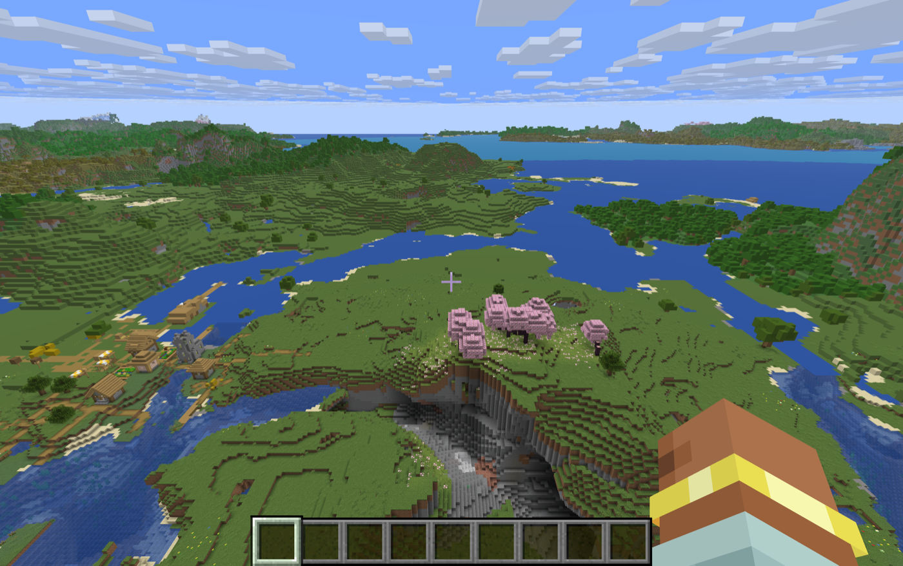

# MetalMC

An experimental Metal terrain renderer for Minecraft-style worlds on Apple Silicon. The goal is to cover the near-terrain work of Sodium and Nvidium and the far-terrain LOD work of Voxy in one engine.

## In-game: a native Metal backend for Minecraft 26.3

Minecraft 26.x renders through a backend interface (OpenGL, and Vulkan via MoltenVK on Macs). The `mod/` Fabric mod adds a third backend that talks to Metal directly: Java 25's FFM API calls into a Swift library (`Sources/MetalMCNative/Backend.swift`), and the game's SPIR-V shaders are translated to MSL with the SPIRV-Cross that ships with the game. It renders the vanilla game unmodified, with no shader or content changes.

Fullscreen 4112×2580 on an M3 Pro, same route and world, all runs from one session ([details](results/metal-26.3/README.md)):

| Backend | FPS (mean of runs) | Mean frame ms | p99 ms | Frames >8 ms per 60 s |
|---|---|---|---|---|
| OpenGL (vanilla) | 179 | 5.58 | 7.8 | 79 |
| Vulkan via MoltenVK (vanilla) | 250 | 3.99 | 7.2 | 55–58 |
| **Metal (MetalMC)** | **402** | **2.49** | **4.1** | **13–20** |

Screenshots of the same pose match Vulkan's (95% of pixels within 15/255; the rest is the player's arm mid-animation). The backend is currently GPU-bound at this resolution. Run it with `./gradlew runClient -PmetalBackend=metal` from `mod/`, after `swift build -c release`.

### Far-terrain LOD (Voxy-style, clean-room)

With `-Plod=1`, the mod draws far terrain past vanilla's render distance: voxel levels built from the world's region files and from chunks as the game loads them, streamed as the world changes, and drawn inside Minecraft's main pass with the game's own projection and fog. On servers it builds from the chunks you've seen there and saves them per server ([design](docs/lod-design.md), [results](results/lod-v1/README.md)). On a pregenerated 4 km world, fullscreen M3 Pro:

| Setup | Terrain visible to | FPS |
|---|---|---|
| Vanilla, render distance 32 | 512 blocks | 185 |
| **Render distance 12 + LOD** | **2,048 blocks** | **327** |
| **Render distance 12 + LOD** (8.2 km world) | **8,192 blocks** | **318** |

That is 4–16× the view distance at 72–77% higher FPS. Those numbers come from an orbit 150 blocks up. At ground level, occlusion culling skips LOD hidden behind hills, and the 8 km LOD runs at 362 fps, against 382 with no LOD. LOD colors come from Minecraft's block textures with per-biome grass, foliage and water tints, so the seam with vanilla chunks is hard to see.



### Install (Minecraft 26.3, Apple Silicon)

1. Install [Fabric Loader](https://fabricmc.net/use/installer/) 0.19.5+ for Minecraft 26.3, and put [Fabric API](https://modrinth.com/mod/fabric-api) in your `mods` folder.
2. Build the mod: `cd mod && ./gradlew build` (needs Xcode's Swift toolchain and JDK 25). Copy `mod/build/libs/metalmc-0.1.0.jar` into `mods`. The jar bundles the Metal library, which is extracted to `<game dir>/metalmc/natives/` on first launch.
3. Settings are in `config/metalmc.properties`, created on first launch: `backend=metal|off`, `facingCulling`, `lod`, `lod.far` (blocks), `lod.live`, and `lod.multiplayer`. If Metal can't start, Minecraft falls back to its own backends.

It's experimental. It has been tested on one M3 Pro, in single-player and on a local server, and it isn't compatible with other rendering mods (Sodium, Iris).

## Standalone engine status: milestone 2 (near engine), mostly done

- **Milestone 1:** loads Minecraft 26.x worlds from Anvil region files. That includes 26.x's palette changes: plain-string entries, `{"": name}` wrappers, and `{id, properties}`.
- **Milestone 2:**
  - Quads are 4 bytes each, expanded by the vertex shader.
  - Greedy meshing, face-direction buckets, backface culling, and reverse-Z depth.
  - Golden-hash and fuzzy image-diff checks.

Results on `claudeworld` (841 chunks, M3 Pro, 1280×720, 600-frame camera path):

| Step | Quads | GPU memory | GPU ms (mean) |
|---|---|---|---|
| M1: 16-byte vertices + indices | 2.48M | 208.4 MB | 2.42 |
| + backface culling, reverse-Z | 2.48M | 208.4 MB | 1.82 |
| + 4-byte pulled quads | 2.48M | 9.6 MB | 2.61 |
| + face buckets | 2.48M | 9.6 MB | 1.81 |
| + greedy meshing | 0.95M | 3.7 MB | 1.07 |
| + GPU-driven culling (`--gpu-cull`, opt-in) | 0.95M | 4.2 MB | 1.37 (CPU 0.49 → 0.025 ms) |

### Milestone 5 prototype: far-terrain LOD rings

This builds on the procedural world (`--lod N`). Ring k uses cells 2^k blocks wide, with height detail capped at `--lod-vmax` blocks (default 8). Each ring covers radius 256·2^(k-1) to 256·2^k blocks. Heights are sampled straight from the terrain function, as Distant Horizons does. Rings are meshed by the same greedy mesher, drawn with the same 4-byte quads, and each section carries its own scale. Rings are hollow in the middle, so every edge gets skirt walls that hide cracks.

| Reach (pan camera) | Quads | GPU memory | GPU ms mean / p99 |
|---|---|---|---|
| 480 blocks (no LOD) | 135K | 0.8 MB | 0.20 / 0.48 (terrain ends; 24% sky below the horizon) |
| 8,192 blocks (`--lod 5`, height detail tied to ring size) | 765K | 3.7 MB | 0.63 / 1.01 |
| 32,768 blocks (`--lod 7 --lod-vmax 8`) | 2.41M | 10.3 MB | 1.14 / 1.29 |

GPU-driven culling is bit-identical to the golden references. Its extra GPU time comes from resetting and walking one indirect-command-buffer slot per section. Compacting those slots is planned for milestone 4.

Procedural 64×64 chunks: 534K quads, 2.2 MB, GPU 0.37 ms mean / 0.97 ms p99.

## Build

```bash
swift build -c release
```

## Run

Interactive: WASD to move, E or Space to go up, Q to go down, arrow keys to look.

```bash
.build/release/MetalMCViewer --chunks 32
```

Benchmark (offscreen). It writes `frames.csv`, PNG captures, and `summary.txt`, and prints one `BENCH` line.

```bash
.build/release/MetalMCViewer --bench --chunks 32 --frames 600 --out bench_out
```

Load a real world save, then check it against golden hashes or a reference run:

```bash
.build/release/MetalMCViewer --bench --world fixtures/claudeworld --golden goldens/claudeworld.txt --compare bench_out/ref_m2d
```

A/B switches: `--no-cull`, `--cw`, `--standard-z`, `--no-buckets`, `--no-greedy`.

## Telemetry

| Field | Meaning |
|---|---|
| `cpu_ms` | CPU time to cull and encode a frame |
| `gpu_ms` | `gpuEndTime - gpuStartTime` of the frame's command buffer |
| `culled_pct` | Share of non-empty sections skipped by frustum or fog culling |
| `hole_pct` | Share of lower-half pixels still matching the sky color. The camera always looks down at terrain, so a nonzero value means missing geometry |

## Roadmap

1. Load real Minecraft worlds from Anvil `.mca` region files.
2. GPU-driven culling with Metal object and mesh shaders.
3. Far-terrain LOD, Voxy-style.
4. Shading: sun shadows, sky, and fog.
5. In-game integration as a Fabric mod.

Backface culling stays off until an image test checks face winding.

## Benchmark protocol

- Every run records its conditions (a `CONDITIONS` line in `summary.txt`: thermal state at start and end, Low Power Mode, GPU frame-time standard deviation). Runs are never deleted.
- A run may be excluded only for interference identified in advance: Low Power Mode on, thermal state `serious` or `critical`, or another GPU-heavy process running. Every exclusion is recorded with its reason.
- High variance is not grounds for exclusion. It may be the stutter we are looking for, so it gets investigated.
- Standalone numbers (procedural worlds, the LOD prototype, `fixtures/`) describe that workload only. In-game claims need in-game measurements against the Minecraft 26.3 OpenGL and Vulkan baselines.

## Target

Minecraft Java 26.3, the current release. We'll port when 26.4 ships. In 26.x, overworld region files are at `dimensions/minecraft/overworld/region/`. Test worlds go in `fixtures/`, which git ignores.

## Clean-room policy

Sodium (PolyForm Shield) and Voxy (All Rights Reserved) are studied for techniques only, and none of their code is used. Code adapted from LGPL-3.0 projects, such as Distant Horizons, is credited in the file where it's used.

## License

LGPL-3.0-only. See `COPYING.LESSER` and `COPYING`.
